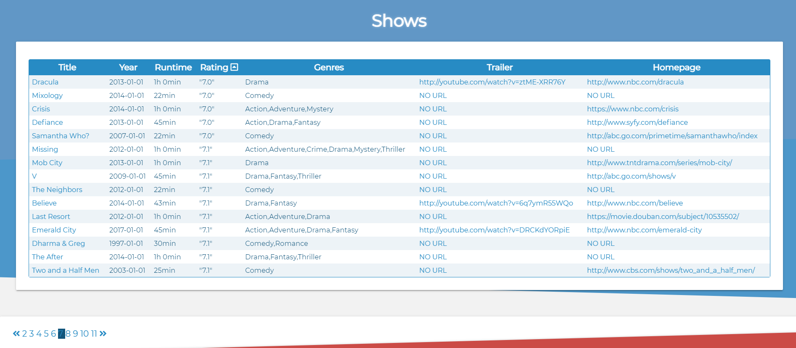
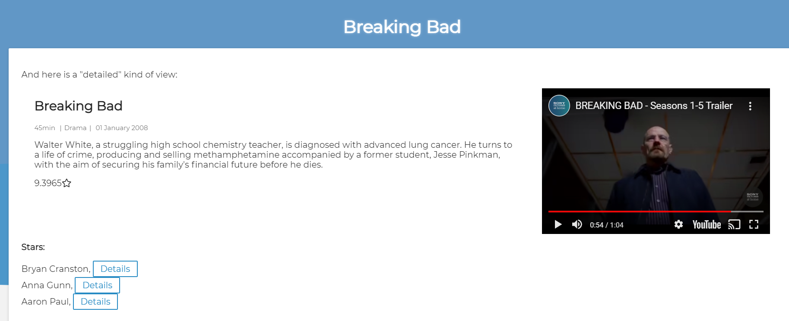

# Codecool series

_Project developed in November 2020. (Codecool course)_ 
_Developer: Joanna Rzeszótko-Doniec_

## Project assumptions

- `PostgreSQL` queries 
- `Flask` 
- `Jinja2`
- `JavaScript`;
- Sorting, pagination
- Page with details

